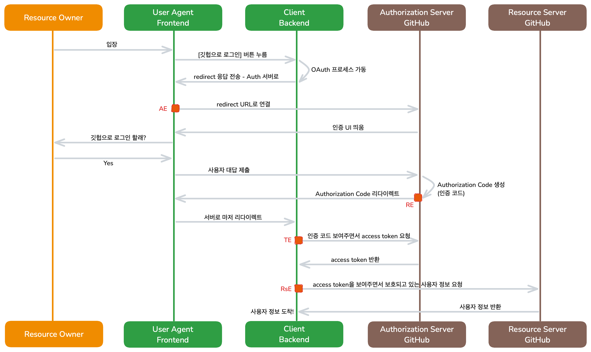

# 2025.05.21(수) TIL

## 오늘 한 작업

- 코드스쿼드 팀 프로젝트 '이슈 트래커 작업' 3주차

  - 로그인 UI 다듬기 - 다크모드 적용
  - 필터 UI 구현 중
  <!-- - 로그인/회원가입 UI 구현 -->

- 이론 공부

  - OAuth 공부
  - 'HTTP 완벽 가이드' 책 구매 → 공부 시작

<br/><br/>

## 오늘 작업 및 학습한 핵심 내용 정리

### 'HTTP 완벽 가이드' 책 학습

#### 1장. HTTP 개관 (~p.7)

- **HTTP 개요**
  - HTTP는 WWW(월드 와이드 웹)에서 웹의 구성요소들이 서로 통신하는 데 사용되는 규약(프로토콜)이다.
  - HTTP는 데이터 전송 중 손상 및 꼬이지 않음을 보장한다.
  - HTTP 클라이언트와 HTTP 서버는 웹의 기본 요소이며,  
    HTTP 클라이언트는 요청을 보내고 HTTP 서버는 요청의 응답을 보내는 방식으로 서로 소통한다.
  - 웹 브라우저는 HTTP 클라이언트의 대표적인 흔한 예시이다.
- **리소스**
  - 웹 리소스는 웹 서버에서 관리하는 웹 콘텐츠의 원천이다.
  - HTTP 관점에서의 리소스란 “URI(Uniform Resource Identifier)로 식별할 수 있는 모든 것”을 뜻한다.
  - 리소스는 어떤 형태든 가능하다. 정적인 파일이거나 동적인 프로그램일 수도 있다.
  - 리소스 vs 표현
    - 리소스: URI로 식별되는 추상적인 개념
    - 표현: 클라이언트가 실제로 받아보는 바이트 스트림(HTML, JSON, XML, 이미지 등) - 구체적인 데이터로 웹 서버가 생성 및 관리
  - “검색 엔진”이라는 서비스도,
    그 검색 결과 페이지나 검색 API 엔드포인트도 모두 웹 리소스의 한 종류이다.
- **미디어 타입**
  - 웹 서버는 모든 HTTP 객체 데이터에 MIME 타입을 붙인다.
  - 웹브라우저는 서버로부터 받은 객체의 MIME 타입을 통해 다룰 수 있는 객체인지 파악한다.
  - MIME 타입은 문자열 라벨로 다음과 같은 예시들이 있다.
    - `text/html` `text/plain` `image/jpeg` `image/gif` `video/quicktime` `application/vnd.ms-powerpoint`
- **URI**
  - Uniform Resource Identifier로 리소스를 고유하게 식별하고 위치를 지정할 수 있는, 인터넷의 우편물 주소같은 것이다.
  - HTTP는 주어진 URI로 객체를 찾아온다.

<br/><br/>

### OAuth 학습



OAuth 2.0의 Authorization Code Grant 방식은 **보안 강화**와 **사용자 경험**을 모두 고려하여, 클라이언트(백엔드 서버)가 민감한 정보를 직접 관리하고, 브라우저에는 노출하지 않는 방식입니다.

#### 주요 주체(Actors)

| 주체                  | 표시 색   | 역할                                             |
| --------------------- | --------- | ------------------------------------------------ |
| Resource Owner        | 🔶 오렌지 | 사용자 본인(GitHub 계정 소유자)                  |
| User Agent (Frontend) | 🟢 초록   | 브라우저 또는 모바일 앱 UI                       |
| Client Backend        | 🟢 초록   | 애플리케이션 서버, `client_secret` 관리          |
| Authorization Server  | 🟤 갈색   | GitHub 인증 서버, 인증 코드/토큰 발급            |
| Resource Server       | 🟤 갈색   | GitHub API 서버, 보호된 리소스(사용자 정보) 제공 |

<br/>

#### 📊 상세 흐름 단계

#### 1. 로그인 시작

1. 사용자가 애플리케이션의 로그인 화면에 접속
2. “GitHub으로 로그인” 버튼 클릭 → **User Agent** → **Client Backend**에 “OAuth 절차 시작” 요청

#### 2. 권한 요청 (Authorization Request)

3. **Client Backend**가 HTTP 302 Redirect 응답 생성
   - URL:
     ```
     https://github.com/login/oauth/authorize?
       client_id={CLIENT_ID}
       &redirect_uri={REDIRECT_URI}
       &scope=read:user%20user:email
       &state={랜덤 문자열}
     ```
4. **User Agent**가 위 URL로 이동 → **Authorization Server**에 요청

#### 3. 사용자 인증 및 동의

5. **Authorization Server**가 로그인·동의 UI 표시
6. 사용자가 GitHub 로그인(또는 이미 로그인됨)
7. 권한 요청(“이 앱이 내 정보에 접근해도 될까요?”) 화면에서 **허용(Yes)** 클릭

#### 4. 인증 코드 발급 (Authorization Code)

8. GitHub이 `authorization_code` 생성
9. **redirect_uri**로 HTTP 302 Redirect
   ```
   GET {REDIRECT_URI}?code={AUTH_CODE}&state={원래 state}
   ```

#### 5. 토큰 교환 (Token Exchange)

10. 브라우저가 **Client Backend**로 `code`와 `state` 전달
11. **Client Backend**가 GitHub 토큰 엔드포인트로 POST 요청

    ```
    POST https://github.com/login/oauth/access_token
    Content-Type: application/json
    Accept: application/json

    {
      "client_id": "{CLIENT_ID}",
      "client_secret": "{CLIENT_SECRET}",
      "code": "{AUTH_CODE}",
      "redirect_uri": "{REDIRECT_URI}"
    }
    ```

12. GitHub이 `access_token` 발급 후 JSON 반환
    ```json
    {
      "access_token": "gho_XXXXXXXXXXXXXXXXX",
      "token_type": "bearer",
      "scope": "read:user,user:email"
    }
    ```

### 6. 보호 리소스 요청 (Resource Request)

13. **Client Backend**가 **Resource Server** (GitHub API)에 GET 요청
    ```
    GET https://api.github.com/user
    Authorization: Bearer {access_token}
    ```
14. GitHub API가 사용자 프로필(이메일, 닉네임 등) JSON 응답

### 7. 로그인 완료

15. **Client Backend**가 자체 세션 또는 JWT 생성
16. **User Agent**에 로그인 상태 전달 → UI 갱신

<br/>

### 장점

- `client_secret`이 브라우저에 노출되지 않음
- 사용자는 자신의 GitHub 비밀번호를 제3자 앱에 직접 제공하지 않음
- 언제든 GitHub 계정 설정에서 토큰 권한을 취소·회수 가능
- 표준화된 흐름으로 다양한 OAuth 제공자에 적용 가능

<br/>
